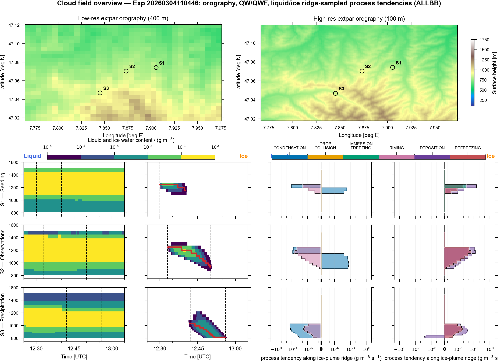
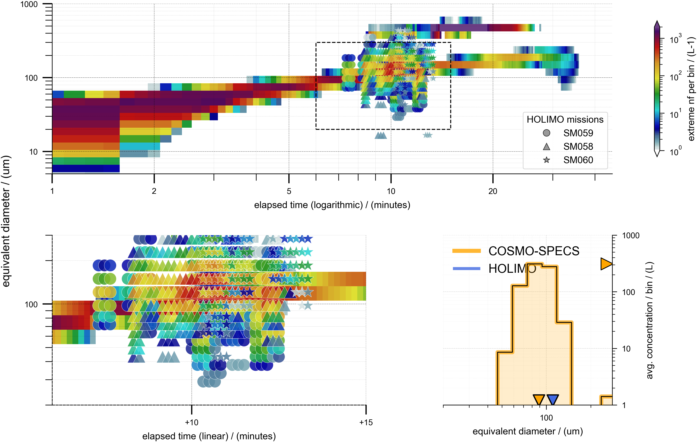
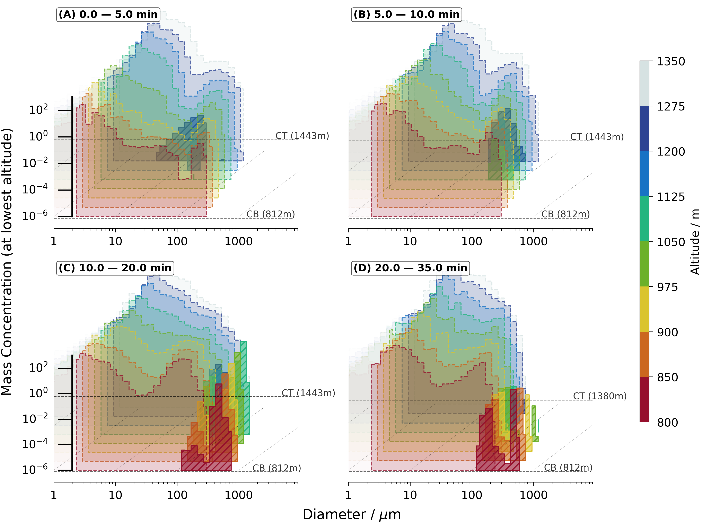
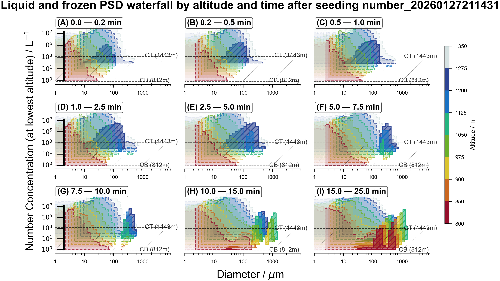

# Paper draft figure gallery

Latest paper-ready figures and videos. **Quicklook on GitHub:** images below render when you browse this folder; click video links to play in GitHub’s blob view.

---

## Figures

### Fig 1 — Cloud field overview

*Cloud-scale context for the ALLBB seeded plume. Orography and the three analysis sites (seeding, ice-growth, downstream precipitation) are shown above; below, time-height liquid and frozen water content and ridge-sampled liquid/ice source-sink tendencies summarize the local microphysical regime. The sequence suggests a transition from a liquid-rich source region to a downstream ice-growth and precipitation regime that defines the plume evolution analysed in the later figures.*

---

### Fig 12 — Ensemble-mean plume path

*Ensemble-mean Lagrangian plume evolution in equivalent-diameter space with HOLIMO comparison. COSMO-SPECS ice number per bin grows from small newly formed particles into a broad O(100 um) population during the first 10-15 min after seeding; the zoom and histogram show that HOLIMO samples the same growth regime, but with spread in concentration and in the large-particle tail. The figure tests whether the spectral-bin Lagrangian simulation captures the observed timing and size range of ice growth along the plume.*

---

### Fig 13 — PSD altitude–time (mass)

*Altitude-resolved liquid and frozen PSD mass in successive post-seeding windows. Early windows are dominated by liquid mass at small diameters, whereas later windows show increasing frozen mass at larger diameters and progressively lower levels. This indicates that, once ice is initiated aloft, subsequent plume evolution is governed mainly by growth and fallout rather than by continued primary formation.*

---

### Fig 13 — PSD altitude–time (number)

*Altitude-resolved liquid and frozen PSD number concentration in successive post-seeding windows. Frozen number appears first at small-to-intermediate diameters and comparatively high levels, then expands toward larger diameters and lower altitudes with time. This figure isolates where new ice crystals are produced, complementing the mass view that diagnoses their subsequent growth.*

---

## Videos (click to play on GitHub)

- **[Spectral waterfall — number](spectral_waterfall_N_cs-eriswil__20260304_110254_exp0_stn0-1-2_ALLBB_evolution_nframes242.mp4)** — Animated ridge-following spectral budget (View D) in number space, linking the evolving PSD to diameter-resolved liquid and frozen process tendencies and separating early ice-number production from later redistribution and removal.
- **[Spectral waterfall — mass](spectral_waterfall_Q_cs-eriswil__20260304_110254_exp0_stn0-1-2_ALLBB_evolution_nframes242.mp4)** — Animated ridge-following spectral budget (View D) in mass space, showing which processes subsequently grow, redistribute, and remove ice mass across the size spectrum.

---

## Files in this folder

| File | Description |
|------|-------------|
| `figure_captions.yaml` | Caption text for each figure; edit to match the manuscript. |
| `gallery.ipynb` | Jupyter notebook that loads all images/videos with captions. Run from repo root. |

Figures are merged from `notebooks/output` and `output/gfx`; this directory is the canonical set for the draft. **Fig 01** uses the ridge-sampled cloud field overview from `output/gfx/png/01/cloud_field_overview_mass_profiles_steps_symlog_<exp>_ALLBB.png`.

**Live gallery page:** Enable [GitHub Pages](https://docs.github.com/en/pages) with **Source: branch `main`, folder `/` (root)** so that `output/gallery` is served. Then open **[docs/gallery.html](../docs/gallery.html)** or `https://<owner>.github.io/polarcap_analysis/docs/gallery.html` for a single page with all figures and embedded videos.
