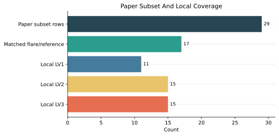
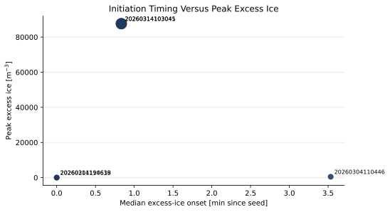
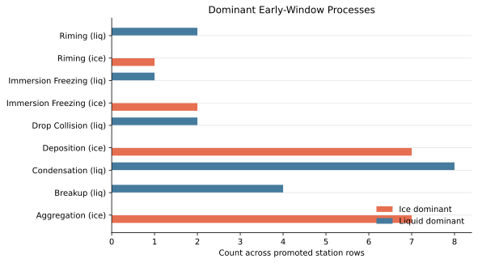
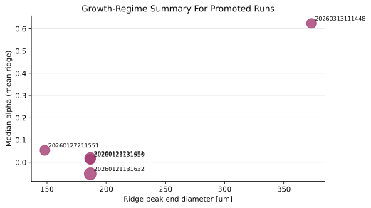
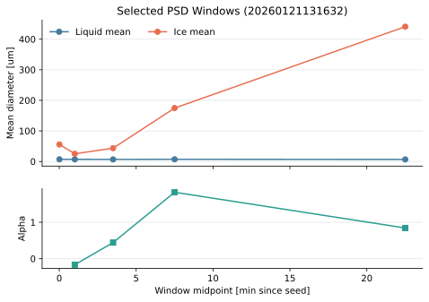
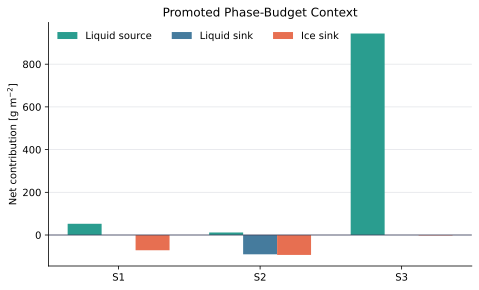

# PolarCAP Refresh Report

This report summarizes the refreshed canonical outputs under `output/tables/`.

- HTML version: `analysis_refresh_report.html`
- Processing log: `../registry/processing_refresh_log.md`
- Processed sync report: `../registry/processed_sync_report.md`

## Key Numbers

- **Paper subset rows:** 29
- **Flare rows:** 17
- **Supported claims:** 8
- **Remaining stage gaps:** 39
- **Local LV2 rows:** 15
- **Local LV3 rows:** 15

## Context

- Outputs were rebuilt from the canonical `data/processed/` view and written to `output/tables/`.
- Missing remote LV3 rates for `cs-eriswil__20260304_110254` were regenerated locally before the phase-budget tables were rebuilt.
- Legacy manuscript table paths in `data/registry/paper_tables/` remain synchronized with the canonical paper table directory.
- The report now includes regenerated manuscript PNG figures where available, followed by derived SVG summaries from the refreshed canonical CSV tables.

## Regenerated Figure Artifacts

### Cloud Overview

Cloud-scale context for the ALLBB seeded plume. The upper panels show the topography and the three analysis sites used for the seeding, ice-growth, and downstream-precipitation diagnostics; the lower panels show time-height liquid and frozen water content together with ridge-sampled liquid and ice source-sink tendencies. The figure defines the transition from a liquid-rich source region to the downstream ice-growth and precipitation regime analyzed in the later figures.


### Plume-Lagrangian Evolution

Ensemble-mean Lagrangian plume evolution in equivalent-diameter space compared with HOLIMO observations. Colors show the ensemble-mean ice number density per logarithmic diameter interval along the plume; symbols identify the three HOLIMO missions, the lower-left panel zooms the first 15 min after seeding, and the lower-right panel compares time-averaged size spectra. The comparison highlights growth from 1-10 um into 10-50 um and 100-300 um size ranges, while the observational spread remains largest in the coarse-particle tail.


### PSD Waterfall (Mass)

Altitude-resolved particle size distribution evolution in successive post-seeding windows for the promoted plume-path runs. Each panel compares liquid and frozen spectra in either number or mass space, making it possible to track where excess ice first appears and how condensate shifts toward larger diameters and lower levels as the plume matures. Together, the number and mass views separate initial crystal production from subsequent growth and fallout.


### PSD Waterfall (Number)

Altitude-resolved particle size distribution evolution in successive post-seeding windows for the promoted plume-path runs. Each panel compares liquid and frozen spectra in either number or mass space, making it possible to track where excess ice first appears and how condensate shifts toward larger diameters and lower levels as the plume matures. Together, the number and mass views separate initial crystal production from subsequent growth and fallout.


### Spectral Growth Interactive HTML

Animated ridge-following spectral budget for the seeded plume. Each frame combines the liquid and frozen particle size distributions with diameter-resolved microphysical tendencies at the selected stations, either in number-concentration space (N) or mass-concentration space (Q). The animation separates the processes that first generate excess ice shortly after seeding from those that later grow, redistribute, and remove condensate across the spectrum.

[Open interactive artifact](../../gfx/html/05/cs-eriswil__20260304_110254/ridge_growth_Q_stn0_interactive.html)


## Derived Figures

### Coverage summary

Paper subset rows, matched references, and local LV1/LV2/LV3 availability.



### Initiation summary

Median excess-ice onset against peak excess ice for promoted flare runs with onset detections.



### Process attribution

Counts of dominant early-window ice and liquid pathways across the promoted station rows.



### Growth summary

Promoted LV1 ridge-growth cases in diameter-alpha space.



### Selected PSD windows

Liquid and ice mean diameters plus alpha across the featured PSD time windows.



### Phase-budget context

Compact source/sink magnitudes for the promoted `20260304110446` overview case.



## Claim Snapshot

| Claim ID                      | Claim                                                                                                  | Evidence              | Source table                 | Status    |
| ----------------------------- | ------------------------------------------------------------------------------------------------------ | --------------------- | ---------------------------- | --------- |
| dataset.paper_subset_size     | The paper subset contains promoted flare and reference experiments with stable registry gating.        | 29                    | tab_experiment_matrix.csv    | supported |
| results.first_ice_onset       | First excess-ice onset occurs within minutes of seeding in the promoted flare subset.                  | 0.8333333333333334    | tab_initiation_metrics.csv   | supported |
| results.peak_excess_ice       | Promoted flare runs show measurable excess ice relative to matched references.                         | 87676.171875          | tab_initiation_metrics.csv   | supported |
| results.early_ice_process     | The pilot early-window matrix identifies a repeatable dominant frozen-number pathway.                  | Aggregation (ice)     | tab_process_attribution.csv  | supported |
| results.early_liq_process     | The pilot early-window matrix identifies the main competing liquid-number pathway.                     | Condensation (liq)    | tab_process_attribution.csv  | supported |
| results.growth_alpha          | The promoted growth summary supports a coherent power-law growth regime along plume trajectories.      | 8.792448744890355e-16 | tab_growth_summary.csv       | supported |
| results.ridge_size            | Tracked plume ridges grow into large-particle sizes on the order of hundreds of micrometers.           | 186.6021012676984     | tab_growth_summary.csv       | supported |
| appendix.phase_budget_context | The compact cloud phase-budget summary provides a stable context table for the promoted overview case. | CONDENSATION          | tab_phase_budget_summary.csv | supported |

## Manuscript Figure Context

| Artifact                 | Script                                                    | Output target                                                                       | Caption                                                                                                                                                                                                                                                                                                                                                                                                                                                                                                                                                |
| ------------------------ | --------------------------------------------------------- | ----------------------------------------------------------------------------------- | ------------------------------------------------------------------------------------------------------------------------------------------------------------------------------------------------------------------------------------------------------------------------------------------------------------------------------------------------------------------------------------------------------------------------------------------------------------------------------------------------------------------------------------------------------ |
| fig_cloud_field_overview | scripts/analysis/forcing/run_cloud_field_overview.py      | output/gfx/png/01/cloud_field_overview_mass_profiles_steps_symlog_<exp>_<range>.png | Cloud-scale context for the ALLBB seeded plume. The upper panels show the topography and the three analysis sites used for the seeding, ice-growth, and downstream-precipitation diagnostics; the lower panels show time-height liquid and frozen water content together with ridge-sampled liquid and ice source-sink tendencies. The figure defines the transition from a liquid-rich source region to the downstream ice-growth and precipitation regime analyzed in the later figures.                                                             |
| fig_plume_lagrangian     | scripts/analysis/growth/run_plume_lagrangian_evolution.py | output/gfx/png/03/figure12_ensemble_mean_plume_path_foo.png                         | Ensemble-mean Lagrangian plume evolution in equivalent-diameter space compared with HOLIMO observations. Colors show the ensemble-mean ice number density per logarithmic diameter interval along the plume; symbols identify the three HOLIMO missions, the lower-left panel zooms the first 15 min after seeding, and the lower-right panel compares time-averaged size spectra. The comparison highlights growth from 1-10 um into 10-50 um and 100-300 um size ranges, while the observational spread remains largest in the coarse-particle tail. |
| fig_psd_waterfall        | scripts/analysis/growth/run_psd_waterfall.py              | output/gfx/png/04/figure13_psd_alt_time_<kind>_<run_id>.png                         | Altitude-resolved particle size distribution evolution in successive post-seeding windows for the promoted plume-path runs. Each panel compares liquid and frozen spectra in either number or mass space, making it possible to track where excess ice first appears and how condensate shifts toward larger diameters and lower levels as the plume matures. Together, the number and mass views separate initial crystal production from subsequent growth and fallout.                                                                              |
| fig_spectral_waterfall   | scripts/analysis/growth/run_spectral_waterfall.py         | output/gfx/mp4/05/<cs_run>/... or output/gallery/*.mp4                              | Animated ridge-following spectral budget for the seeded plume. Each frame combines the liquid and frozen particle size distributions with diameter-resolved microphysical tendencies at the selected stations, either in number-concentration space (N) or mass-concentration space (Q). The animation separates the processes that first generate excess ice shortly after seeding from those that later grow, redistribute, and remove condensate across the spectrum.                                                                               |

## Paper Tables

### experiment_matrix

COSMO-SPECS experiment subset used for the manuscript synthesis. Rows list flare and reference simulations retained by the registry gate, together with the matched reference experiment and local data availability flags.

- Rows: `29`
- CSV: `../paper/tab_experiment_matrix.csv`
- TeX: `../paper/tab_experiment_matrix.tex`

| CS run                      | Exp. | Expname        | Ref. | Flare emission | ishape | ikeis | Domain  | Matched ref.   | Pair method      | LV1 | LV2 | LV3 | In paper |
| --------------------------- | ---- | -------------- | ---- | -------------- | ------ | ----- | ------- | -------------- | ---------------- | --- | --- | --- | -------- |
| cs-eriswil__20260120_204218 | 0    | 20260120204219 | No   | 1.0e+06        | 4      | 1     | 50x40xZ | 20260120204430 | single_reference | No  | No  | No  | Yes      |
| cs-eriswil__20260120_204218 | 1    | 20260120204430 | Yes  | 0.0e+00        | 1      | 1     | 50x40xZ |                |                  | No  | No  | No  | Yes      |
| cs-eriswil__20260120_204218 | 2    | 20260120204641 | No   | 1.0e+06        | 1      | 1     | 50x40xZ | 20260120204430 | same_shape       | No  | No  | No  | Yes      |
| cs-eriswil__20260121_131528 | 0    | 20260121131528 | Yes  | 0.0e+00        | 1      | 1     | 50x40xZ |                |                  | Yes | No  | No  | Yes      |
| cs-eriswil__20260121_131528 | 1    | 20260121131550 | No   | 1.0e+06        | 1      | 1     | 50x40xZ | 20260121131528 | same_shape       | Yes | No  | No  | Yes      |
| cs-eriswil__20260121_131528 | 2    | 20260121131632 | No   | 1.0e+06        | 4      | 1     | 50x40xZ | 20260121131528 | single_reference | Yes | No  | No  | Yes      |
| cs-eriswil__20260127_211338 | 0    | 20260127211338 | Yes  | 0.0e+00        | 2      | 1     | 50x40xZ |                |                  | Yes | No  | No  | Yes      |
| cs-eriswil__20260127_211338 | 1    | 20260127211431 | No   | 1.0e+06        | 2      | 1     | 50x40xZ | 20260127211338 | same_shape       | Yes | No  | No  | Yes      |
| cs-eriswil__20260127_211338 | 2    | 20260127211516 | Yes  | 0.0e+00        | 3      | 1     | 50x40xZ |                |                  | Yes | No  | No  | Yes      |
| cs-eriswil__20260127_211338 | 3    | 20260127211551 | No   | 1.0e+06        | 3      | 1     | 50x40xZ | 20260127211516 | same_shape       | Yes | No  | No  | Yes      |


Showing first 10 of 29 rows.

### initiation_metrics

Initiation diagnostics for the manuscript experiment subset. Ice-onset timing is summarized across stations relative to the seeding time and is reported together with peak excess ice and excess INP signals.

- Rows: `9`
- CSV: `../paper/tab_initiation_metrics.csv`
- TeX: `../paper/tab_initiation_metrics.tex`

| CS run                      | Exp. | Expname        | Matched ref.   | N stn | Ice onset stn | Ice onset min | Ice onset med | Ice onset max | Peak excess ice | Peak excess INP |
| --------------------------- | ---- | -------------- | -------------- | ----- | ------------- | ------------- | ------------- | ------------- | --------------- | --------------- |
| cs-eriswil__20260210_113944 | 0    | 20260210113944 | 20260210114519 | 1     | 0             |               |               |               | 0.00            |                 |
| cs-eriswil__20260210_113944 | 2    | 20260210114328 | 20260210114136 | 1     | 0             |               |               |               | 0.00            |                 |
| cs-eriswil__20260211_194236 | 2    | 20260211194619 | 20260211194427 | 3     | 3             | 0.00          | 0.00          | 11.48         | 31.07           | 6.78            |
| cs-eriswil__20260304_110254 | 0    | 20260304110446 | 20260304110829 | 3     | 2             | 2.28          | 3.53          | 4.78          | 483.76          | 0.00            |
| cs-eriswil__20260304_110254 | 1    | 20260304110638 | 20260304110829 | 3     | 3             | 0.00          | 0.00          | 11.68         | 20.40           | 6.78            |
| cs-eriswil__20260304_110254 | 3    | 20260304111020 | 20260304110829 | 3     | 0             |               |               |               | 0.07            | 0.00            |
| cs-eriswil__20260304_110254 | 4    | 20260304111212 | 20260304110829 | 3     | 0             |               |               |               | 0.19            | 0.00            |
| cs-eriswil__20260314_103039 | 1    | 20260314103041 | 20260314103040 | 3     | 3             | 0.00          | 0.83          | 0.83          | 87676.17        | -0.28           |
| cs-eriswil__20260314_103039 | 3    | 20260314103045 | 20260314103044 | 3     | 3             | 0.00          | 0.83          | 0.83          | 87593.95        | -0.28           |


### process_attribution

Early-window pilot process-attribution matrix for manuscript-ready runs. The table lists the dominant and runner-up pathways for frozen-number and liquid-number tendencies in the initial post-seeding window.

- Rows: `17`
- CSV: `../paper/tab_process_attribution.csv`
- TeX: `../paper/tab_process_attribution.tex`

| CS run                      | Expname        | Station | Ice dominant             | Ice frac. | Ice runner-up          | Liq dominant             | Liq frac. | Liq runner-up            | Window min |
| --------------------------- | -------------- | ------- | ------------------------ | --------- | ---------------------- | ------------------------ | --------- | ------------------------ | ---------- |
| cs-eriswil__20260210_113944 | 20260210113944 | S1      | Aggregation (ice)        | 0.0%      | Contact Freezing (ice) | Breakup (liq)            | 0.0%      | Condensation (liq)       | 2.50       |
| cs-eriswil__20260210_113944 | 20260210114328 | S1      | Aggregation (ice)        | 0.0%      | Contact Freezing (ice) | Breakup (liq)            | 0.0%      | Condensation (liq)       | 2.50       |
| cs-eriswil__20260211_194236 | 20260211194619 | S1      | Deposition (ice)         | 100.0%    | Aggregation (ice)      | Riming (liq)             | 100.0%    | Breakup (liq)            | 2.50       |
| cs-eriswil__20260211_194236 | 20260211194619 | S2      | Aggregation (ice)        | 0.0%      | Contact Freezing (ice) | Immersion Freezing (liq) | 100.0%    | Breakup (liq)            | 2.50       |
| cs-eriswil__20260211_194236 | 20260211194619 | S3      | Deposition (ice)         | 100.0%    | Aggregation (ice)      | Drop Collision (liq)     | 100.0%    | Immersion Freezing (liq) | 2.50       |
| cs-eriswil__20260304_110254 | 20260304110446 | S1      | Immersion Freezing (ice) | 100.0%    | Riming (ice)           | Condensation (liq)       | 100.0%    | Riming (liq)             | 2.50       |
| cs-eriswil__20260304_110254 | 20260304110446 | S2      | Deposition (ice)         | 89.0%     | Riming (ice)           | Condensation (liq)       | 100.0%    | Riming (liq)             | 2.50       |
| cs-eriswil__20260304_110254 | 20260304110446 | S3      | Aggregation (ice)        | 0.0%      | Contact Freezing (ice) | Breakup (liq)            | 0.0%      | Condensation (liq)       | 2.50       |
| cs-eriswil__20260304_110254 | 20260304110638 | S1      | Deposition (ice)         | 100.0%    | Aggregation (ice)      | Riming (liq)             | 100.0%    | Condensation (liq)       | 2.50       |
| cs-eriswil__20260304_110254 | 20260304110638 | S2      | Immersion Freezing (ice) | 100.0%    | Aggregation (ice)      | Condensation (liq)       | 100.0%    | Drop Collision (liq)     | 2.50       |


Showing first 10 of 17 rows.

### growth_summary

Lagrangian growth-regime summary for the manuscript subset. Ridge-growth metrics are combined with promoted PSD statistics to summarize the characteristic size evolution and power-law exponents.

- Rows: `5`
- CSV: `../paper/tab_growth_summary.csv`
- TeX: `../paper/tab_growth_summary.tex`

| CS run                      | Exp. | Expname        | Matched ref.   | N cells | N times | Alpha peak med | Alpha mean med | Ridge end um | Ridge late um | End time min |
| --------------------------- | ---- | -------------- | -------------- | ------- | ------- | -------------- | -------------- | ------------ | ------------- | ------------ |
| cs-eriswil__20260121_131528 | 1    | 20260121131550 | 20260121131528 | 3       | 208     | 0.00           | 0.01           | 186.6        | 186.6         | 29.5         |
| cs-eriswil__20260121_131528 | 2    | 20260121131632 | 20260121131528 | 5       | 252     | 0.01           | -0.05          | 186.6        | 186.6         | 36.8         |
| cs-eriswil__20260127_211338 | 1    | 20260127211431 | 20260127211338 | 4       | 208     | 0.00           | 0.02           | 186.6        | 186.6         | 29.5         |
| cs-eriswil__20260127_211338 | 3    | 20260127211551 | 20260127211516 | 3       | 108     | -0.00          | 0.05           | 148.1        | 148.1         | 12.8         |
| cs-eriswil__20260313_111441 | 3    | 20260313111448 | 20260313111446 | 3       | 89      | 0.52           | 0.62           | 373.2        | 373.2         | 13.5         |


### psd_stats_selected

Per-frame plume-path PSD diagnostics for the automatically selected featured run. Time windows report liquid and frozen mean diameters, net tendencies, and the local power-law exponent for ice mean diameter.

- Rows: `5`
- CSV: `../paper/tab_psd_stats_selected.csv`
- TeX: `../paper/tab_psd_stats_selected.tex`

| Time frame  | Liq mean um | Liq std um | Liq tend./min | Ice mean um | Ice std um | Ice tend./min | Alpha | HOLIMO match | Obs ice mean um | Obs ice std um | Run ID         |
| ----------- | ----------- | ---------- | ------------- | ----------- | ---------- | ------------- | ----- | ------------ | --------------- | -------------- | -------------- |
| 0.00-0.02   | 7.0         | 4.0        | 0.00          | 55.6        | 49.7       | 0.00          |       |              |                 |                | 20260121131632 |
| 0.02-2.00   | 6.9         | 3.9        | 15.26         | 25.1        | 9.5        | 0.21          | -0.17 |              |                 |                | 20260121131632 |
| 2.00-5.00   | 6.7         | 3.8        | 755.34        | 43.5        | 15.2       | -0.04         | 0.44  |              |                 |                | 20260121131632 |
| 5.00-10.00  | 7.0         | 3.7        | -22.91        | 174.7       | 135.2      | -0.01         | 1.82  |              |                 |                | 20260121131632 |
| 10.00-35.00 | 6.6         | 3.6        | -8.14         | 440.9       | 88.9       | -0.01         | 0.84  |              |                 |                | 20260121131632 |


### phase_budget_summary

Compact phase-budget context table accompanying the cloud overview diagnostic. Each row lists the dominant source and sink terms for the selected phase window and station.

- Rows: `3`
- CSV: `../paper/tab_phase_budget_summary.csv`
- TeX: `../paper/tab_phase_budget_summary.tex`

| Station | Phase window | Liq source   | Liq source g m-2 | Liq sink       | Liq sink g m-2 | Ice source | Ice source g m-2 | Ice sink   | Ice sink g m-2 |
| ------- | ------------ | ------------ | ---------------- | -------------- | -------------- | ---------- | ---------------- | ---------- | -------------- |
| S1      | Early ice    | CONDENSATION | 52.60            | DROP_COLLISION | -0.00          |            |                  | DEPOSITION | -71.39         |
| S2      | Ice growth   | RIMING       | 11.83            | CONDENSATION   | -90.39         |            |                  | DEPOSITION | -93.24         |
| S3      | Ice precip.  | CONDENSATION | 943.61           | DROP_COLLISION | -0.00          |            |                  | DEPOSITION | -1.89          |


### phase_budget_long

Long-form phase-budget table for the promoted cloud-overview case. Net phase-integrated process contributions are listed per station, phase window, reservoir, and process.

- Rows: `42`
- CSV: `../paper/tab_phase_budget_long.csv`
- TeX: `../paper/tab_phase_budget_long.tex`

| Station           | Phase window | T start min | T end min | Reservoir | Process              | Net g m-2 |
| ----------------- | ------------ | ----------- | --------- | --------- | -------------------- | --------- |
| S1 — Seeding loc. | Early ice    | 0.1         | 12.0      | liquid    | CONDENSATION         | 52.60     |
| S1 — Seeding loc. | Early ice    | 0.1         | 12.0      | liquid    | BREAKUP              | 0.00      |
| S1 — Seeding loc. | Early ice    | 0.1         | 12.0      | liquid    | DROP_COLLISION       | -0.00     |
| S1 — Seeding loc. | Early ice    | 0.1         | 12.0      | liquid    | DROP_INS_COLLISION   | 0.00      |
| S1 — Seeding loc. | Early ice    | 0.1         | 12.0      | liquid    | HOMOGENEOUS_FREEZING | 0.00      |
| S1 — Seeding loc. | Early ice    | 0.1         | 12.0      | liquid    | RIMING               | 0.25      |
| S1 — Seeding loc. | Early ice    | 0.1         | 12.0      | liquid    | MELTING              | 0.00      |
| S1 — Seeding loc. | Early ice    | 0.1         | 12.0      | ice       | IMMERSION_FREEZING   | -0.69     |
| S1 — Seeding loc. | Early ice    | 0.1         | 12.0      | ice       | CONTACT_FREEZING     | 0.00      |
| S1 — Seeding loc. | Early ice    | 0.1         | 12.0      | ice       | RIMING               | -0.25     |


Showing first 10 of 42 rows.

## Remaining Gaps

| Run                         | Stage         | Gap note                                   | M files | 3D files |
| --------------------------- | ------------- | ------------------------------------------ | ------- | -------- |
| cs-eriswil__20260120_204218 | lv1_tracking  | missing_processed_but_raw_3d_present       | 0       | 3        |
| cs-eriswil__20260120_204218 | lv1_paths     | missing_processed_but_raw_3d_present       | 0       | 3        |
| cs-eriswil__20260120_204218 | lv2_meteogram | no_source_found                            | 0       | 3        |
| cs-eriswil__20260120_204218 | lv2_3d        | no_source_found                            | 0       | 3        |
| cs-eriswil__20260120_204218 | lv3_rates     | missing_processed_but_lv2_inputs_may_exist | 0       | 3        |
| cs-eriswil__20260120_204218 | manifests     | no_source_found                            | 0       | 3        |
| cs-eriswil__20260121_131528 | lv1_tracking  | missing_processed_but_raw_3d_present       | 0       | 3        |
| cs-eriswil__20260121_131528 | lv2_meteogram | no_source_found                            | 0       | 3        |
| cs-eriswil__20260121_131528 | lv2_3d        | no_source_found                            | 0       | 3        |
| cs-eriswil__20260121_131528 | lv3_rates     | missing_processed_but_lv2_inputs_may_exist | 0       | 3        |
| cs-eriswil__20260121_131528 | manifests     | no_source_found                            | 0       | 3        |
| cs-eriswil__20260127_211338 | lv1_tracking  | missing_processed_but_raw_3d_present       | 0       | 4        |

## Source Logs

### Processing Refresh Log

```markdown
# Processing Refresh Log

Date: 2026-03-27

Environment:

- Processing and rebuild commands were run in `pcpaper_env`.
- Canonical manuscript-facing outputs now live under `output/tables/`.

## Processed Root

- `data/processed/` was refreshed from these source roots:
- `/work/bb1262/user/schimmel/cosmo-specs-torch/cosmo-specs-runs/RUN_ERISWILL_50x40x100/ensemble_output`
- `/work/bb1262/user/schimmel/cosmo-specs-torch/cosmo-specs-runs/RUN_ERISWILL_200x160x100/ensemble_output`
- `/scratch/b/b382237/schimmel/cosmo-specs-runs/ensemble_output`
- `output/tables/registry/processed_sync_report.md` now reports 18 scanned runs and 67 stage rows.
- Current processed-root status summary: 28 `already_present`, 39 `missing`.
- Missing remote LV3 rates for `cs-eriswil__20260304_110254` were regenerated locally into `data/processed/cs-eriswil__20260304_110254/lv3_rates/`.
- The regenerated `20260304` LV3 stage wrote 5 local NetCDF files and occupies about `19G`.

## Registry Outputs

- `availability_check.csv`: 9 rows
- `analysis_registry.csv`: 33 rows
- `paper_core_subset.csv`: 29 rows
- `first_ice_onset_metrics.csv`: 23 rows
- `initiation_process_fractions.csv`: 260 rows
- `pilot_process_attribution_matrix.csv`: 17 rows
- `psd_stats.csv`: 60 rows
- `ridge_metrics.csv`: 5 rows
- `growth_summary.csv`: 5 rows
- `claim_register.csv`: 8 rows
- `figure_inventory.csv`: 11 rows

## Paper Tables

- `tab_experiment_matrix.csv`: 29 rows
- `tab_initiation_metrics.csv`: 9 rows
- `tab_process_attribution.csv`: 17 rows
- `tab_growth_summary.csv`: 5 rows
- `tab_psd_stats_selected.csv`: 5 rows
- `tab_phase_budget_summary.csv`: 3 rows
- `tab_phase_budget_long.csv`: 42 rows

## Validation

- All 7 compiled paper tables exist in both `output/tables/paper/` and `data/registry/paper_tables/`.
- Matching canonical and legacy CSV file sizes were verified for all 7 compiled paper tables.
- The current paper subset contains 29 included rows, 17 matched flare/reference rows, 11 rows with local LV1, 15 rows with local LV2, and 15 rows with local LV3.
- The promoted cloud phase-budget tables for `20260304110446` and range `ALLBB` were rebuilt successfully after fixing local LV3 and ExtPar path resolution.

## Remaining Gaps

- `output/tables/registry/processed_sync_report.md` still lists 39 missing stage rows across runs that do not yet have complete promoted processed outputs.
- The remaining missing stages are concentrated in older runs that still lack LV1 tracking, LV2 meteograms, LV2 3D products, or LV3 rates.
- The paper-facing growth summary still covers 5 runs because only those runs currently have compatible local LV1 plume-path products.

## Storage

- `data/processed/cs-eriswil__20260304_110254/lv3_rates`: `19G`
- `output/tables`: `381K`
- `cwq` on `/work`: `17.98T / 25T`
```

### Processed Sync Report

```markdown
# Processed Root Sync Report

- Canonical target: `/home/b/b382237/code/polarcap/python/polarcap_analysis/data/processed`
- Source roots checked: `/work/bb1262/user/schimmel/cosmo-specs-torch/cosmo-specs-runs/RUN_ERISWILL_50x40x100/ensemble_output`, `/work/bb1262/user/schimmel/cosmo-specs-torch/cosmo-specs-runs/RUN_ERISWILL_200x160x100/ensemble_output`, `/scratch/b/b382237/schimmel/cosmo-specs-runs/ensemble_output`
- Runs scanned: `18`
- Stage rows: `67`

## Status Summary

- `already_present`: 28
- `missing`: 39

## Missing Or Rebuild Candidates

- `cs-eriswil__20260120_204218` / `lv1_tracking`: missing_processed_but_raw_3d_present (3D=3, M=0, json=1)
- `cs-eriswil__20260120_204218` / `lv1_paths`: missing_processed_but_raw_3d_present (3D=3, M=0, json=1)
- `cs-eriswil__20260120_204218` / `lv2_meteogram`: no_source_found (3D=3, M=0, json=1)
- `cs-eriswil__20260120_204218` / `lv2_3d`: no_source_found (3D=3, M=0, json=1)
- `cs-eriswil__20260120_204218` / `lv3_rates`: missing_processed_but_lv2_inputs_may_exist (3D=3, M=0, json=1)
- `cs-eriswil__20260120_204218` / `manifests`: no_source_found (3D=3, M=0, json=1)
- `cs-eriswil__20260121_131528` / `lv1_tracking`: missing_processed_but_raw_3d_present (3D=3, M=0, json=1)
- `cs-eriswil__20260121_131528` / `lv2_meteogram`: no_source_found (3D=3, M=0, json=1)
- `cs-eriswil__20260121_131528` / `lv2_3d`: no_source_found (3D=3, M=0, json=1)
- `cs-eriswil__20260121_131528` / `lv3_rates`: missing_processed_but_lv2_inputs_may_exist (3D=3, M=0, json=1)
- `cs-eriswil__20260121_131528` / `manifests`: no_source_found (3D=3, M=0, json=1)
- `cs-eriswil__20260127_211338` / `lv1_tracking`: missing_processed_but_raw_3d_present (3D=4, M=0, json=1)
- `cs-eriswil__20260127_211338` / `lv2_meteogram`: no_source_found (3D=4, M=0, json=1)
- `cs-eriswil__20260127_211338` / `lv2_3d`: no_source_found (3D=4, M=0, json=1)
- `cs-eriswil__20260127_211338` / `lv3_rates`: missing_processed_but_lv2_inputs_may_exist (3D=4, M=0, json=1)
- `cs-eriswil__20260127_211338` / `manifests`: no_source_found (3D=4, M=0, json=1)
- `cs-eriswil__20260210_113944` / `lv1_tracking`: no_source_found (3D=0, M=12, json=1)
- `cs-eriswil__20260210_113944` / `lv1_paths`: no_source_found (3D=0, M=12, json=1)
- `cs-eriswil__20260210_113944` / `lv2_3d`: no_source_found (3D=0, M=12, json=1)
- `cs-eriswil__20260210_113944` / `manifests`: no_source_found (3D=0, M=12, json=1)
- `cs-eriswil__20260211_194236` / `lv1_tracking`: missing_processed_but_raw_3d_present (3D=4, M=12, json=1)
- `cs-eriswil__20260211_194236` / `lv1_paths`: missing_processed_but_raw_3d_present (3D=4, M=12, json=1)
- `cs-eriswil__20260211_194236` / `lv2_3d`: no_source_found (3D=4, M=12, json=1)
- `cs-eriswil__20260211_194236` / `manifests`: no_source_found (3D=4, M=12, json=1)
- `cs-eriswil__20260304_110254` / `lv1_tracking`: no_source_found (3D=0, M=15, json=1)
- `cs-eriswil__20260304_110254` / `lv1_paths`: no_source_found (3D=0, M=15, json=1)
- `cs-eriswil__20260304_110254` / `lv2_3d`: no_source_found (3D=0, M=15, json=1)
- `cs-eriswil__20260313_111441` / `lv2_meteogram`: no_source_found (3D=4, M=0, json=1)
- `cs-eriswil__20260313_111441` / `lv2_3d`: no_source_found (3D=4, M=0, json=1)
- `cs-eriswil__20260313_111441` / `lv3_rates`: missing_processed_but_lv2_inputs_may_exist (3D=4, M=0, json=1)
- `cs-eriswil__20260313_140150` / `lv1_tracking`: no_source_found (3D=0, M=0, json=0)
- `cs-eriswil__20260313_140150` / `lv1_paths`: no_source_found (3D=0, M=0, json=0)
- `cs-eriswil__20260313_140150` / `lv2_meteogram`: no_source_found (3D=0, M=0, json=0)
- `cs-eriswil__20260313_140150` / `lv2_3d`: no_source_found (3D=0, M=0, json=0)
- `cs-eriswil__20260313_140150` / `lv3_rates`: no_source_found (3D=0, M=0, json=0)
- `cs-eriswil__20260313_140150` / `manifests`: no_source_found (3D=0, M=0, json=0)
- `cs-eriswil__20260314_103039` / `lv1_tracking`: no_source_found (3D=0, M=12, json=1)
- `cs-eriswil__20260314_103039` / `lv1_paths`: no_source_found (3D=0, M=12, json=1)
- `cs-eriswil__20260314_103039` / `lv2_3d`: no_source_found (3D=0, M=12, json=1)
```
