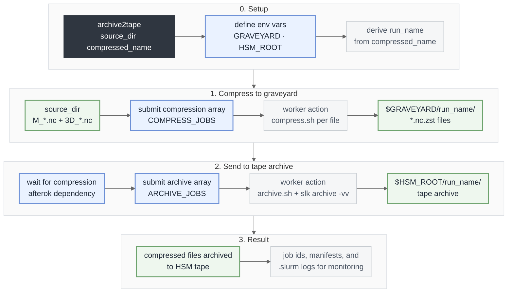

# NetCDF compression and HSM archive

- `compress.sh`: list/compress/extract `M_*.nc` and `3D_*.nc`
- `archive.sh`: list `*.nc.zst` or archive one file via `slk archive -vv`
- `run_compess_and_archive.sh`: submits compression+archive Slurm arrays
- `archive2tape`: short wrapper command

Before archiving on Levante, run `module load slk` and `slk login`.

DKRZ docs:

- [Archivals to tape](https://docs.dkrz.de/doc/datastorage/hsm/archivals.html#)
- [Getting Started with slk](https://docs.dkrz.de/doc/datastorage/hsm/getting_started.html)

## Enable `archive2tape` from anywhere

```bash
export POLARCAP_ROOT=/path/to/polarcap_analysis
export PATH="$POLARCAP_ROOT/scripts/nc_compression:$PATH"
```

## Command

Compress and archive NetCDF files from one source directory to one HSM tape.
```bash
archive2tape [source_dir] <compressed_name>
```

Compress and archive NetCDF files from multiple source directories to one HSM tape.

```bash
cd /path/to/ensemble_output
for d in ./cs-eriswil__*
do
    [[ -d "$d" ]] || continue
    archive2tape "$d" "${d}.tar.zst"
done
```

## Workflow sketch




**Legend**

- **Dark gray**: command entrypoint (`archive2tape`)
- **Blue**: active processing steps (setup, submit jobs, dependency wait)
- **Green**: data and storage states (source, graveyard, HSM)
- **Light gray**: metadata and monitoring details
- **Pale stage container**: grouped workflow stage

Example:

```bash
cd /path/to/ensemble_output
archive2tape ./cs-eriswil__20260318_153631 cs-eriswil__20260318_153631.tar.zst
```

Behavior:

1. Create run dir in `$GRAVEYARD`: `cs-eriswil__YYYYMMDD_HHMMSS`
2. Compress NetCDF files directly into `$GRAVEYARD/<run_name>/`
3. Archive compressed files to `$HSM_ROOT/<run_name>/`

## Key environmental variables

- `GRAVEYARD` (temporary storage of compressed files, default: `/scratch/b/<user_name>/path/to/ensemble_output`)
- `HSM_ROOT` (HSM storage of archived files, default: `/arch/<project_name>/path/to/cosmo_specs/ensemble_output`)
- `COMPRESS_JOBS` (number of parallel compression jobs, default: `8`)
- `ARCHIVE_JOBS` (number of parallel archive jobs, default: `2`)
- `OVERWRITE=1` (overwrite existing compressed files)
- `RETRY=1` (retry archive if it fails) and `RETRY_DELAY=60` (delay between retries in seconds)
- `LOG_DIR` (optional; default: `./.slurm/<run_name>_<timestamp>/` in the directory where `archive2tape` is executed)

Note: `<user_name>` (e.g. `b382237`) and `<project_name>` (e.g. `bb1262`) are placeholders for your actual user and project names.

## Printed output variables

- `RUN_NAME=...` (derived from the compressed file name)
- `COMPRESSED_DIR=...` (path to the compressed files)
- `HSM_NAMESPACE=...` (path to the HSM archive)
- `COMPRESS_JOB_ID=...` (job ID for the compression job)
- `ARCHIVE_JOB_ID=...` (job ID for the archive job)

