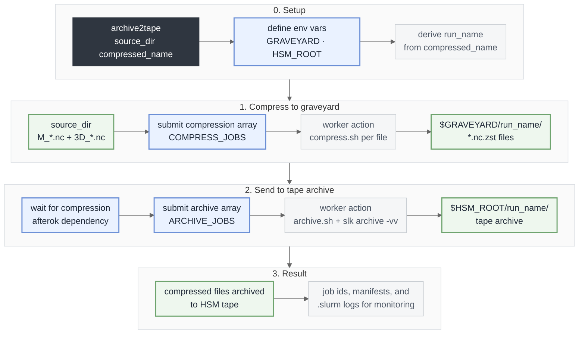

# NetCDF compression and HSM archive

Tools in this folder:

- `archive2tape` - short command wrapper (thin `exec` wrapper)
- `run_compess_and_archive.sh` - Slurm orchestrator (submits jobs + prints summary)
- `compress.sh` - list/compress/extract `M_*.nc` and `3D_*.nc`
- `archive.sh` - list/archive `*.nc.zst` with `slk archive -vv`

Before archiving on Levante, run:

```bash
module load slk
slk login
```

DKRZ references:

- [Archivals to tape](https://docs.dkrz.de/doc/datastorage/hsm/archivals.html#)
- [Getting Started with slk](https://docs.dkrz.de/doc/datastorage/hsm/getting_started.html)

## Quick start

Enable `archive2tape` from anywhere:

```bash
export POLARCAP_ROOT=/path/to/polarcap_analysis
export PATH="$POLARCAP_ROOT/scripts/nc_compression:$PATH"
```

Run one directory:

```bash
archive2tape [source_dir] <compressed_name>
```

Example:

```bash
cd /path/to/ensemble_output
archive2tape ./cs-eriswil__20260318_153631 cs-eriswil__20260318_153631.tar.zst
```

Batch all `cs-eriswil__*` subdirectories in current directory:

```bash
for d in ./cs-eriswil__*; do
  [[ -d "$d" ]] || continue
  run="${d#./}"
  archive2tape "$d" "${run}.tar.zst"
done
```

Compress one Meteogram Zarr store to a single tarball:

```bash
./compress.sh compress /path/to/lv2_meteogram/Meteogram_cs-eriswil__20260318_153631_nVar136_nMet5_nExp4.zarr \
  "$GRAVEYARD/Meteogram_cs-eriswil__20260318_153631_nVar136_nMet5_nExp4.tar.zst"
```

## Workflow



**Legend**

- **Dark gray**: command entrypoint (`archive2tape`)
- **Blue**: active processing steps (setup, submit jobs, dependency wait)
- **Green**: data and storage states (source, graveyard, HSM)
- **Light gray**: metadata and monitoring details
- **Pale stage container**: grouped workflow stage

Behavior in order:

1. Create run dir in `$GRAVEYARD`: `cs-eriswil__YYYYMMDD_HHMMSS`
2. Compress NetCDF files directly into `$GRAVEYARD/<run_name>/`
3. Archive compressed files to `$HSM_ROOT/<run_name>/`

After submission, `run_compess_and_archive.sh` prints an **automatic summary** based on the
current contents of `LOG_DIR` (it will typically show `0` completed/failed immediately,
and update as Slurm writes `archive_*.out` files).

## Archive only (skip compression)

If compression already succeeded and only archiving failed, archive existing `*.nc.zst` files directly.

Sequential:

```bash
module load slk
slk login
run=cs-eriswil__20251125_114053
for f in "$GRAVEYARD/$run"/*.nc.zst; do
  [[ -f "$f" ]] || continue
  scripts/nc_compression/archive.sh archive "$f" "$HSM_ROOT/$run"
done
```

Slurm array (faster):

```bash
for run_dir in ./cs-eriswil__*; do
  [[ -d "$run_dir" ]] || continue
  run="${run_dir#./}"
  manifest="$(mktemp)"
  ls -1 "$GRAVEYARD/$run"/*.nc.zst > "$manifest" 2>/dev/null || { rm -f "$manifest"; continue; }
  n=$(awk 'END{print NR}' "$manifest")
  (( n > 0 )) || { rm -f "$manifest"; continue; }
  archive_jobs="${ARCHIVE_JOBS:-2}"
  (( archive_jobs > 3 )) && archive_jobs=3

  sbatch --array="0-$((n-1))%$archive_jobs" --partition=shared --account=bb1262 --time=04:00:00 --mem=8G \
    --export="ALL,MANIFEST=$manifest,HSM_NS=$HSM_ROOT/$run,SCRIPT_DIR=$PWD/scripts/nc_compression,RETRY=1,RETRY_DELAY=60" <<'EOF'
#!/usr/bin/env bash
set -euo pipefail
f="$(sed -n "$((SLURM_ARRAY_TASK_ID+1))p" "$MANIFEST")"
"$SCRIPT_DIR/archive.sh" archive "$f" "$HSM_NS"
EOF
done
```

When an archive task fails, `archive.sh` prints a `WARNING:` message (and warns again before retry if `RETRY=1`).

## Configuration reference

Key environment variables:

- `GRAVEYARD`: temporary location for compressed files
- `HSM_ROOT`: destination tape namespace root
- `COMPRESS_JOBS`: compression array concurrency (default `8`)
- `ARCHIVE_JOBS`: archive array concurrency (default `2`, capped at `3`)
- `OVERWRITE=1`: overwrite existing compressed files
- `RETRY=1`: retry failed archive once
- `RETRY_DELAY=60`: wait time before retry in seconds
- `LOG_DIR`: optional log root (default `./.slurm/<run_name>_<timestamp>/` where `archive2tape` is executed)

Printed output variables:

- `RUN_NAME=...`
- `COMPRESSED_DIR=...`
- `HSM_NAMESPACE=...`
- `LOG_DIR=...`
- `COMPRESS_JOB_ID=...`
- `ARCHIVE_JOB_ID=...`

Note: `<user_name>` and `<project_name>` in path examples are placeholders.

